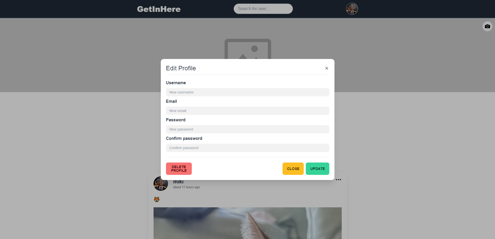

# Get In Here - Social media app built with PERN stack 

Link to live demo: https://www.getinhere.pl/

Deployed to Render

# Technologies used:
- VITE/REACT
- TYPESCRIPT
- TAILWINDCSS
- POSTGRESQL
- REACT QUERY
- REACT ROUTER
- Node/Express
- cookies/JWT for session
- Cloudinary for images upload

# Features:
- Login/Register
- Share posts
- Comments/Likes
- Upload images/avatar/background image
- Edit posts/comments/profile
- Search for users

# Images:

